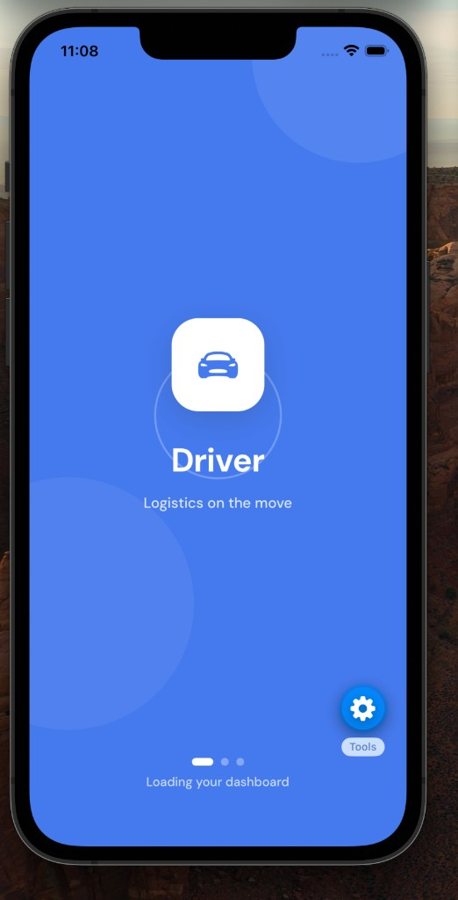
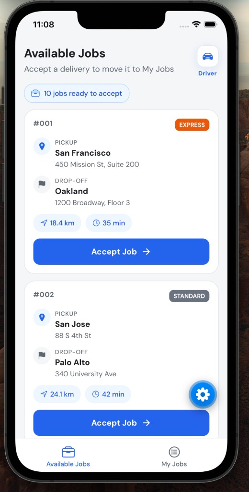
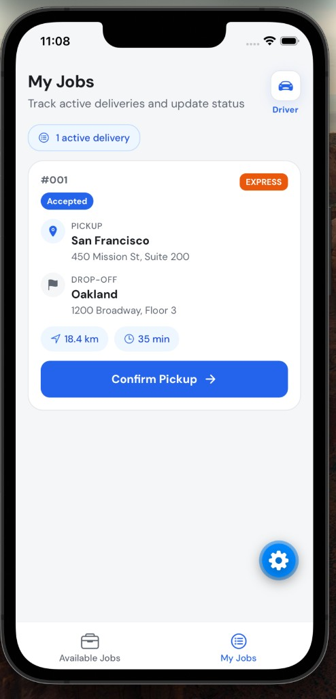
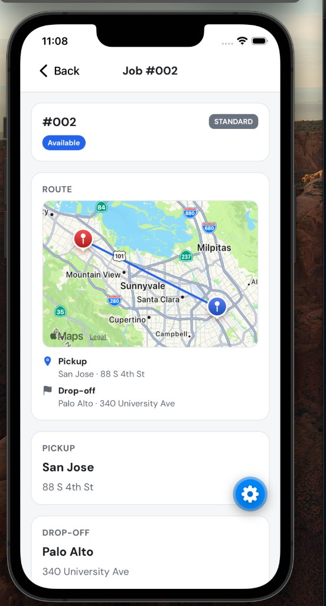

# Logistics Driver App

React Native (Expo) application for the driver-facing side of a logistics platform, built as a technical case study. Drivers can browse available jobs, accept deliveries, update status, and view job details with a map and progress tracker.

## Features

- **Job feed:** list available jobs with pickup, drop-off, priority, and estimates
- **Accept jobs:** move accepted jobs from the feed to My Jobs
- **My Jobs:** track active deliveries and advance status (`Accepted` → `Picked Up` → `Delivered`)
- **Job detail:** full job info, status stepper, route map, and action buttons
- **Pull to refresh:** reload jobs from the mock API
- **Routing:** bottom tabs + stack — `JobFeed`, `MyJobs`, `JobDetail`
- **In-memory API:** simulated REST backend via `jobsApi.ts`
- **Zustand:** centralized state for jobs, loading, and status transitions
- **Maps:** pickup/drop-off pins and route line on job detail (`react-native-maps`)

## Screenshots

### Splash screen

Animated loading screen shown on app launch while jobs are fetched.



### Available Jobs

Browse and accept delivery jobs. Each card shows pickup, drop-off, priority, distance, and duration.



### My Jobs

Track accepted deliveries and confirm pickup or delivery from the card.



### Job Detail

Full job info with route map, addresses, status stepper, and action buttons.



## Prerequisites

- Node.js 18 or later
- npm
- [Expo Go](https://expo.dev/go) on a physical device, or iOS Simulator / Android Emulator

## Installation

```bash
npm install
```

## Running locally

```bash
npx expo start
```

- Press **`i`** to open the iOS Simulator
- Press **`a`** to open the Android Emulator
- Scan the QR code with Expo Go on your phone

## Demo flow

1. Open **Available Jobs**: tap **Accept Job** on a card
2. Switch to **My Jobs**: job appears as **Accepted**
3. Open job detail: **Confirm Pickup** → **Confirm Delivery**
4. Return to the feed: accepted job does not reappear

## Architecture notes

| Layer | Responsibility |
|-------|----------------|
| `data/mockJobs.ts` | Seed data with Bay Area locations and coordinates |
| `services/jobsApi.ts` | Mock REST calls with simulated latency |
| `store/jobsStore.ts` | Zustand store — load, accept, and advance job status |
| `screens/` | Route-level screens (feed, my jobs, detail, splash) |
| `components/` | JobCard, StatusStepper, JobRouteMap, ScreenHeader, etc. |
| `navigation/` | React Navigation — native stack + bottom tabs |

Status transitions are guarded in both the store and API layer so jobs cannot skip steps (e.g. deliver before pickup).

**Swapping the backend:** replace the internals of `jobsApi.ts` with `fetch()` calls to a real API; the store interface stays the same.

## What I would improve with more time

- Real REST API with driver authentication
- Persistent local storage (state survives app restart)
- Turn-by-turn navigation and GPS geofencing for pickup/delivery
- Push notifications for new job assignments
- Offline support and automated tests for status transitions

## Tech stack

- Expo SDK 56 + TypeScript
- React Navigation (native stack + bottom tabs)
- Zustand
- react-native-maps
- StyleSheet (custom styling, no UI component libraries)
